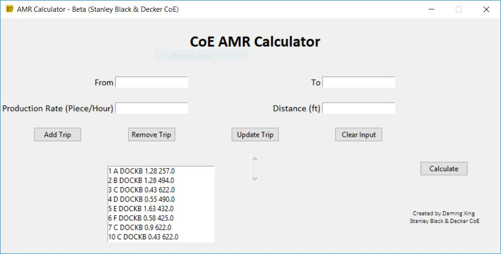

# RobotCalculatorApp

I created this GUI application and algorithms to calculate the number of Automomous Mobile Robots required in a flexible manufacturing systems.

To use this application, you need to know:
1. From where
2. To where
3. Production Rate (piece/hour)
4. Distance (ft)

After you input all the information, press `Calculate`, the application will give you the result
